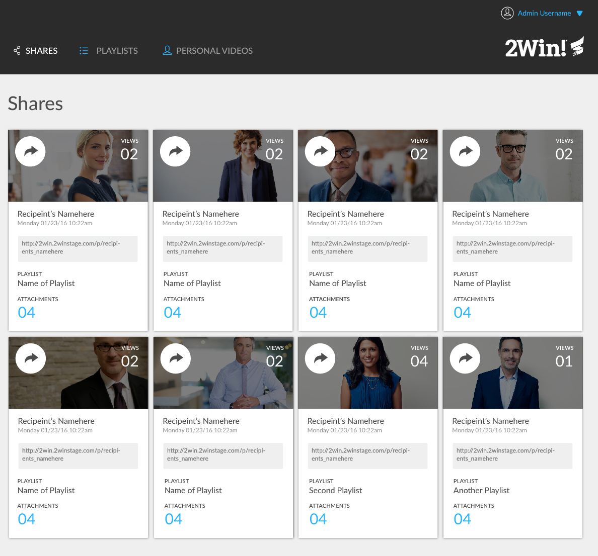
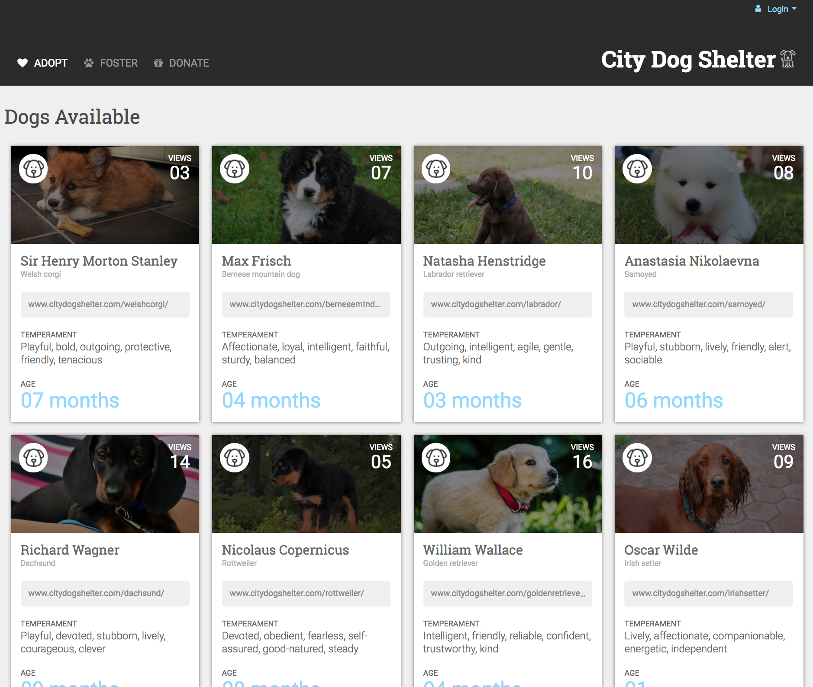

# ms-comp-challenge-2
## Synopsis
This project required the design of a fully responsive website, based on the original comp provided below. My version matches the layout and general colour scheme of the original comp, but differs in thematic content. In addition, the flexibility of the design as one moves to a tablet-size or mobile version of the site was my responsibility to design and execute.

## Original Comp

## My Version

## GitHub Pages
[The Static Comp on GitHub Pages](https://mschae16.github.io/ms-comp-challenge-2/)
## Contributors
Margo Schaedel
